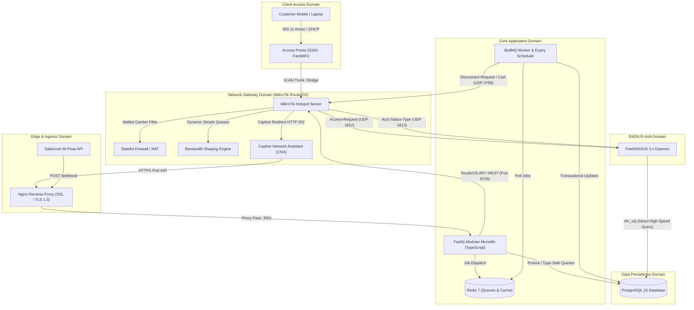
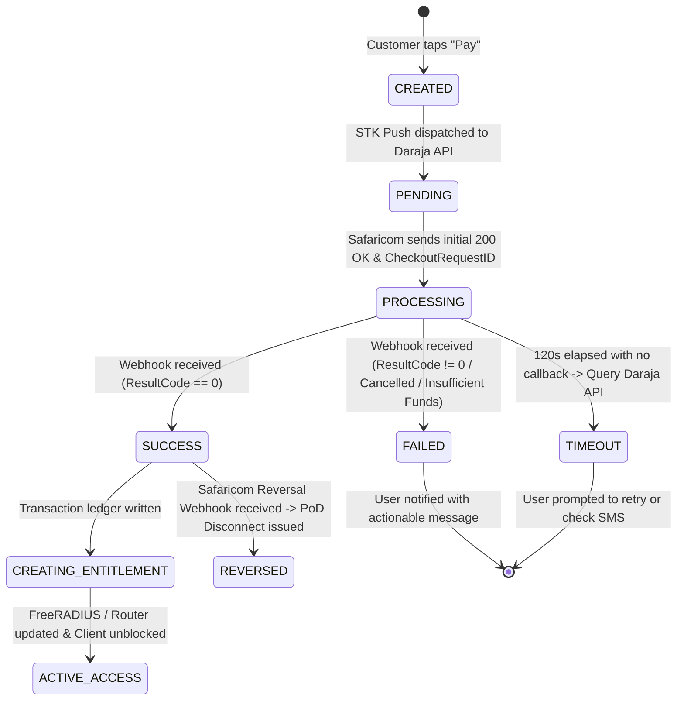

# System Architecture & Technical Specification
## Carrier-Grade WiFi Hotspot Billing & Management Platform

---

### 1. Architectural Topology Overview

The system is partitioned into four decoupled layers:
1. **Physical Network Gateway Layer (MikroTik RouterOS)**
2. **Access, Authentication & Accounting (AAA) Layer (FreeRADIUS 3.x + rlm_sql)**
3. **Core Billing, Entitlement & Orchestration Engine (Node.js/Fastify + TypeScript + PostgreSQL + Redis/BullMQ)**
4. **Presentation Layer (Mobile-First Captive Portal & Next.js Admin Platform)**



---

### 2. Network Gateway Architecture (MikroTik RouterOS)

#### 2.1 Hotspot & Walled Garden
* The MikroTik RouterOS Hotspot intercepts all unauthenticated HTTP traffic (`dst-port=80,443`) and returns an HTTP 302 redirect pointing to the Captive Portal URL:
  `https://portal.yourdomain.com/hotspot?mac=$(mac)&ip=$(ip)&link-login=$(link-login)&link-login-only=$(link-login-only)&link-orig=$(link-orig)`
* **Walled Garden IP and Path Allowlist**:
  - Portal FQDN and IP address.
  - Safaricom Daraja API endpoints (`*.safaricom.co.ke`, `196.201.214.*`).
  - Mobile OS Captive Network Assistant probes:
    - Apple: `captive.apple.com`, `www.ibook.info`, `www.itools.info`.
    - Android: `connectivitycheck.gstatic.com`, `clients3.google.com/generate_204`.
    - Windows: `www.msftconnecttest.com/connecttest.txt`.

#### 2.2 FreeRADIUS AAA Configuration
* RouterOS Hotspot Server profile is configured with:
  - `use-radius=yes`
  - `radius-accounting=yes`
  - `radius-interim-update=60s`
  - `nas-identifier=MT-HOTSPOT-01`
* Incoming CoA/Disconnect listener is enabled:
  `/radius incoming set accept=yes port=3799`

---

### 3. Separation of Domains (The Core Invariant)

To guarantee 100% financial and operational integrity, the platform enforces strict boundary isolation:

```
┌─────────────────┐        ┌─────────────────┐        ┌─────────────────┐
│     PAYMENT     │        │   ENTITLEMENT   │        │ NETWORK SESSION │
├─────────────────┤        ├─────────────────┤        ├─────────────────┤
│ Provider Ref    │        │ Remaining Time  │        │ Gateway IP      │
│ Merchant Req ID │ ─────> │ Remaining Bytes │ ─────> │ Router NAS-IP   │
│ Amount Settled  │        │ Max Devices (1) │        │ Dynamic Queue ID│
│ Customer Phone  │        │ Bound Device ID │        │ Bytes In / Out  │
└─────────────────┘        └─────────────────┘        └─────────────────┘
```

1. **A Payment is an exchange of money**: Owned by the Payment Gateway & Bank. It can succeed, fail, or be reversed.
2. **An Entitlement is a time/quota right**: Created upon successful payment settlement or voucher redemption.
3. **A Network Session is physical traffic passing through a router**: Managed by FreeRADIUS and MikroTik. It can disconnect and reconnect as long as the Entitlement is valid.

---

### 4. Database Architecture & Schema Specification

The PostgreSQL 16 schema enforces relational referential integrity, strict indexing, and native compatibility with FreeRADIUS `rlm_sql`.

```
================================================================================
TABLE: users (Administrators & Staff)
================================================================================
id             : UUID (PK, DEFAULT gen_random_uuid())
email          : VARCHAR(255) (UNIQUE, NOT NULL)
password_hash  : VARCHAR(255) (NOT NULL, Argon2id)
name           : VARCHAR(255) (NOT NULL)
role           : ENUM ('SUPER_ADMIN', 'ADMIN', 'OPERATOR', 'ACCOUNTANT', 'NETWORK_ENGINEER', 'READ_ONLY')
is_active      : BOOLEAN (DEFAULT TRUE)
created_at     : TIMESTAMPTZ (DEFAULT NOW())
updated_at     : TIMESTAMPTZ (DEFAULT NOW())

================================================================================
TABLE: locations (Venues & Sites)
================================================================================
id             : UUID (PK)
name           : VARCHAR(255) (NOT NULL)
slug           : VARCHAR(100) (UNIQUE, NOT NULL)
description    : TEXT
address        : VARCHAR(255)
contact_phone  : VARCHAR(50)
created_at     : TIMESTAMPTZ (DEFAULT NOW())

================================================================================
TABLE: routers (MikroTik Gateways & NAS)
================================================================================
id             : UUID (PK)
location_id    : UUID (FK -> locations.id, ON DELETE RESTRICT)
name           : VARCHAR(255) (NOT NULL)
nas_identifier : VARCHAR(100) (UNIQUE, NOT NULL)
ip_address     : INET (NOT NULL)
radius_secret  : VARCHAR(255) (NOT NULL)
api_port       : INTEGER (DEFAULT 8729)
api_username   : VARCHAR(100)
api_password   : VARCHAR(255) (Encrypted at rest)
is_active      : BOOLEAN (DEFAULT TRUE)
last_heartbeat : TIMESTAMPTZ
created_at     : TIMESTAMPTZ (DEFAULT NOW())

================================================================================
TABLE: plans (Internet Packages)
================================================================================
id             : UUID (PK)
name           : VARCHAR(100) (NOT NULL)
description    : TEXT
price          : DECIMAL(10,2) (NOT NULL)
currency       : VARCHAR(3) (DEFAULT 'KES')
plan_type      : ENUM ('TIME_BASED', 'DATA_BASED', 'HYBRID', 'UNLIMITED')
duration_sec   : INTEGER (Duration in seconds, nullable if pure data)
data_limit_bytes: BIGINT (Quota in bytes, nullable if pure time)
download_speed : INTEGER (kbps, e.g., 5120 for 5Mbps)
upload_speed   : INTEGER (kbps, e.g., 2048 for 2Mbps)
burst_down     : INTEGER (kbps, optional)
burst_up       : INTEGER (kbps, optional)
burst_threshold: INTEGER (kbps, optional)
burst_duration : INTEGER (seconds, optional)
max_devices    : INTEGER (DEFAULT 1)
is_active      : BOOLEAN (DEFAULT TRUE)
location_id    : UUID (FK -> locations.id, NULL = available globally)
created_at     : TIMESTAMPTZ (DEFAULT NOW())

================================================================================
TABLE: customers (WiFi End Users)
================================================================================
id             : UUID (PK)
phone_number   : VARCHAR(20) (INDEXED, NOT NULL)
name           : VARCHAR(255)
email          : VARCHAR(255)
is_guest       : BOOLEAN (DEFAULT TRUE)
created_at     : TIMESTAMPTZ (DEFAULT NOW())

================================================================================
TABLE: devices (User Hardware)
================================================================================
id             : UUID (PK)
customer_id    : UUID (FK -> customers.id, NULLABLE)
mac_address    : MACADDR (INDEXED, NOT NULL)
is_randomized  : BOOLEAN (DEFAULT FALSE)
hostname       : VARCHAR(255)
first_seen     : TIMESTAMPTZ (DEFAULT NOW())
last_seen      : TIMESTAMPTZ (DEFAULT NOW())

================================================================================
TABLE: payments (Payment State Machine)
================================================================================
id                 : UUID (PK)
customer_id        : UUID (FK -> customers.id, NOT NULL)
plan_id            : UUID (FK -> plans.id, NOT NULL)
device_id          : UUID (FK -> devices.id, NOT NULL)
amount             : DECIMAL(10,2) (NOT NULL)
currency           : VARCHAR(3) (DEFAULT 'KES')
provider           : ENUM ('MPESA_DARAYA', 'VOUCHER', 'MANUAL_OVERRIDE')
status             : ENUM ('CREATED', 'PENDING', 'PROCESSING', 'SUCCESS', 'FAILED', 'CANCELLED', 'TIMEOUT', 'REVERSED')
merchant_req_id    : VARCHAR(100) (INDEXED)
checkout_req_id    : VARCHAR(100) (UNIQUE, INDEXED)
provider_ref       : VARCHAR(100) (e.g. M-Pesa Receipt Number, INDEXED)
phone_number       : VARCHAR(20) (NOT NULL)
idempotency_key    : VARCHAR(255) (UNIQUE, NOT NULL)
failure_reason     : TEXT
raw_callback       : JSONB
settled_at         : TIMESTAMPTZ
created_at         : TIMESTAMPTZ (DEFAULT NOW())

================================================================================
TABLE: transactions (Immutable Financial Ledger)
================================================================================
id             : UUID (PK)
payment_id     : UUID (FK -> payments.id, UNIQUE, NOT NULL)
reference_code : VARCHAR(100) (NOT NULL)
amount         : DECIMAL(10,2) (NOT NULL)
currency       : VARCHAR(3) (NOT NULL)
type           : ENUM ('CHARGE', 'REFUND', 'REVERSAL', 'ADJUSTMENT')
created_at     : TIMESTAMPTZ (DEFAULT NOW())

================================================================================
TABLE: entitlements (Access Rights)
================================================================================
id             : UUID (PK)
customer_id    : UUID (FK -> customers.id, NOT NULL)
plan_id        : UUID (FK -> plans.id, NOT NULL)
payment_id     : UUID (FK -> payments.id, NULLABLE)
voucher_id     : UUID (FK -> vouchers.id, NULLABLE)
status         : ENUM ('PENDING', 'ACTIVE', 'DEPLETED', 'EXPIRED', 'REVOKED')
starts_at      : TIMESTAMPTZ
expires_at     : TIMESTAMPTZ
total_bytes    : BIGINT
used_bytes     : BIGINT (DEFAULT 0)
max_devices    : INTEGER (DEFAULT 1)
created_at     : TIMESTAMPTZ (DEFAULT NOW())

================================================================================
TABLE: sessions (Active & Historical Network Sessions)
================================================================================
id             : UUID (PK)
entitlement_id : UUID (FK -> entitlements.id, NOT NULL)
device_id      : UUID (FK -> devices.id, NOT NULL)
router_id      : UUID (FK -> routers.id, NOT NULL)
rad_acct_id    : BIGINT (Links to FreeRADIUS radacct.radacctid)
framed_ip      : INET
mac_address    : MACADDR (NOT NULL)
started_at     : TIMESTAMPTZ (DEFAULT NOW())
last_interim   : TIMESTAMPTZ (DEFAULT NOW())
stopped_at     : TIMESTAMPTZ
bytes_in       : BIGINT (DEFAULT 0)
bytes_out      : BIGINT (DEFAULT 0)
terminate_cause: VARCHAR(50)
status         : ENUM ('ONLINE', 'IDLE', 'EXPIRED', 'DISCONNECTED', 'BLOCKED')

================================================================================
TABLE: vouchers & voucher_batches
================================================================================
voucher_batches:
  id           : UUID (PK)
  name         : VARCHAR(100)
  plan_id      : UUID (FK -> plans.id)
  location_id  : UUID (FK -> locations.id, NULLABLE)
  quantity     : INTEGER
  created_by   : UUID (FK -> users.id)
  created_at   : TIMESTAMPTZ (DEFAULT NOW())

vouchers:
  id           : UUID (PK)
  batch_id     : UUID (FK -> voucher_batches.id)
  code         : VARCHAR(32) (UNIQUE, INDEXED, NOT NULL)
  plan_id      : UUID (FK -> plans.id, NOT NULL)
  status       : ENUM ('AVAILABLE', 'RESERVED', 'USED', 'EXPIRED', 'DISABLED')
  activated_at : TIMESTAMPTZ
  claimed_by   : UUID (FK -> customers.id, NULLABLE)
  claimed_mac  : MACADDR
  expires_at   : TIMESTAMPTZ
  created_at   : TIMESTAMPTZ (DEFAULT NOW())

================================================================================
TABLES: FreeRADIUS Standard Tables (Integrated via rlm_sql)
================================================================================
nas            : Standard FreeRADIUS NAS table (mapped to routers)
radcheck       : RADIUS user checks (Username, Attribute, op, Value)
radreply       : RADIUS return attributes (Session-Timeout, Mikrotik-Rate-Limit)
radacct        : High-frequency accounting updates from MikroTik
```

---

### 5. Payment State Machine & Callback Lifecycle



#### Idempotency Safeguards:
1. `checkout_req_id` is declared `UNIQUE` in PostgreSQL.
2. Webhook receiver executes `BEGIN; SELECT * FROM payments WHERE checkout_req_id = $1 FOR UPDATE;`.
3. If `status == 'SUCCESS'`, return immediate HTTP 200 without reprocessing.
4. If `status == 'PROCESSING'`, transition to `SUCCESS`, insert record into `transactions`, insert record into `entitlements`, and commit transaction.

---

### 6. FreeRADIUS AAA & MikroTik Enforcement Specs

#### 6.1 Authentication (radreply attributes)
When a device with an active entitlement authenticates via MAC Auth or Voucher Code:
* `User-Name`: `<MAC_ADDRESS>` or `<VOUCHER_CODE>`
* `Mikrotik-Rate-Limit`: Calculated dynamically from Plan (e.g. `2048k/5120k 3072k/10240k 1536k/3840k 10/10 8 1024k/2560k`)
* `Session-Timeout`: Remaining entitlement time in seconds (`expires_at - NOW()`)
* `Acct-Interim-Interval`: `60`
* `Port-Limit`: `1` (Disallows multiple concurrent devices using same MAC/Token)

#### 6.2 Packet of Disconnect (RFC 3576 / 5176 CoA)
When an entitlement expires or data quota is exhausted, the BullMQ worker issues a UDP Disconnect-Request using `radclient`:
```bash
echo "User-Name = 00:11:22:33:44:55,Framed-IP-Address = 192.168.88.25" | radclient -x 192.168.88.1:3799 disconnect <RADIUS_SECRET>
```
MikroTik tears down the active hotspot host, destroys the dynamic queue, and returns the device to unauthenticated state.

---

### 7. Administrative Security & Cryptography

* **Password Hashing**: Argon2id with memory cost `65536`, time cost `3`, parallelism `4`.
* **Session Management**: Cryptographically signed HTTP-only cookies (`SameSite=Lax`, `Secure=true`) with Redis-backed session revocation.
* **Router Passwords**: Encrypted at rest using AES-256-GCM with server master key derived from environment variable `APP_SECRET_KEY`.
* **Audit Trail**: Trigger-based or service-layer audit logging recording:
  `actor_id`, `actor_email`, `action`, `resource_type`, `resource_id`, `state_before`, `state_after`, `ip_address`, `timestamp`.
